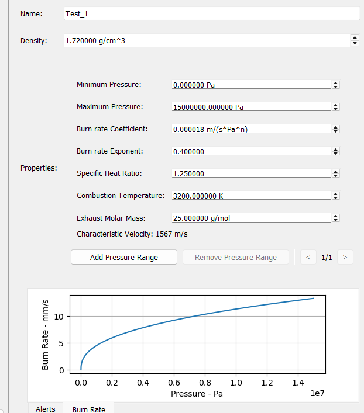
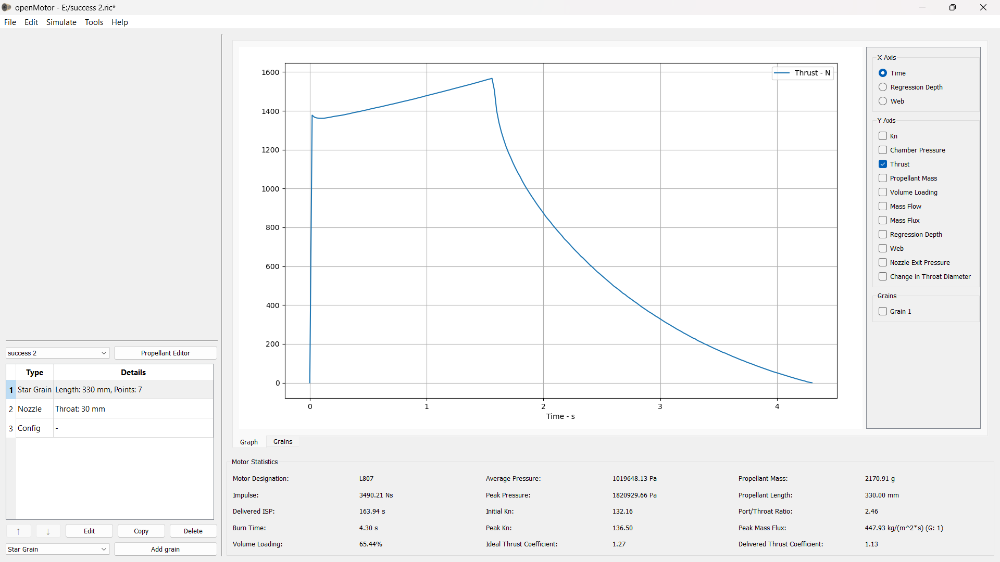
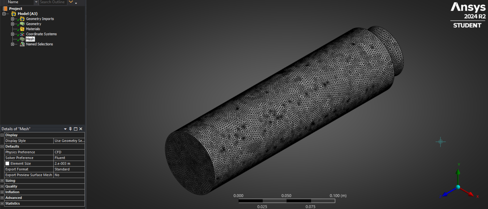
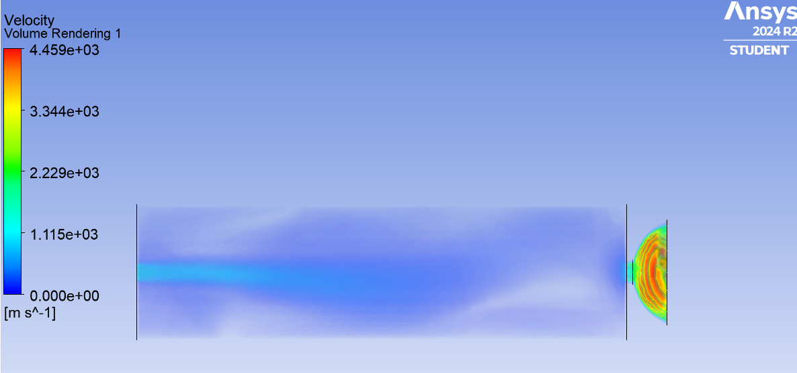

# Analysis Of a Solid Rocket Motor
Analysis of a solid rocket motor (For ISRO InSpace competition) focusing on key propulsion parameters such as chamber pressure, nozzle expansion ratio, and mass flow rate. The study evaluates thrust generation and overall motor performance using fundamental rocket propulsion relations.
## Objective
To study how propulsion parameters such as chamber pressure, nozzle expansion ratio, and mass flow rate affect thrust generation.
## General
- **Basic principles of solid rocket propulsion** - Solid rocket motors generate thrust by burning a solid propellant that produces high-pressure gases inside the combustion chamber. These gases expand through a converging–diverging nozzle to produce high-velocity exhaust and thrust. Here we will be using KNSU propellant which is easily manufacturable.
- **Thrust equation and performance parameters** - The thrust produced by a rocket motor depends on mass flow rate, exhaust velocity, and pressure differences at the nozzle exit. Important performance parameters include thrust, specific impulse, and chamber pressure. OpenMotor will be used to calculate these values on the go.
- **Effect of chamber pressure and nozzle geometry** - Chamber pressure strongly influences the mass flow rate and exhaust velocity of the propellant gases. The geometry of the converging–diverging nozzle determines how efficiently these gases expand to generate thrust.
- **Parametric analysis of propulsion variables** - A parametric study is performed by varying key propulsion parameters such as chamber pressure, throat area, and expansion ratio. This helps identify how different design choices affect the overall performance of the rocket motor. Again, OpenMotor proves to be very helpful here as it can handle multi-variable parameters when coupled with tools like MATLAB for effect analysis of parameters on flight characteristics.
## Tools / Methods
- **OpenMotor** - Our objective here is to make a motor with KNSU propellant in such a way that it can lift a 12kg model rocket upto an apogee of 2000m. To do this we need a slightly bell shaped curve for our thrust graph along with a short burn time.
  
 

- To achieve this,  we can experiment with the grain size and shape and get the desired shape of our graph.

- **MATLAB** - It is used along with OpenMotor to keep track of which parameter causes different kinds of changes with how much intensity as OpenMotor lacks this critical feature leading to a hit and trail approach which can be overrun using MATLAB.

-  **SolidWorks** - The 3D geometry of the motor whose contraints came from OpenMotor is built using Solidworks. This ensures close tolerances and helps in making the geomtery watertight (by using solid boss extrudes only).

- **Ansys** - This is used to see whether the housing of our solid rocket motor is good enough to provide a unidirectional thrust with minimal losses due to back pressure or chamber opressure buildup due to burn times being very short.
The mesh setup is taken as a tetrahedral mesh along the entire cylindrical housing and finer mesh cell sizes are given in the throat and nozzle area to account for jump in values of pressure, sound speed, species tranfer rate, etc.

Combustion is taken care of by adding a boundary condition at the end of a grain with constant mass outflow as we know the properties of our KNSU propellant (derived directly from OpenMotor).
## Outcome
The study provides insight into how propulsion system parameters influence the performance of a solid rocket motor. Chamber pressure is well maintained withing the range of 15MPa which is well under what our casing can hold. Nozzle design ensures partial unidirectionality so fins can be used to stabalise roll mid-flight.
Further design choices for structure of the rocket is done in OpenRocket.

